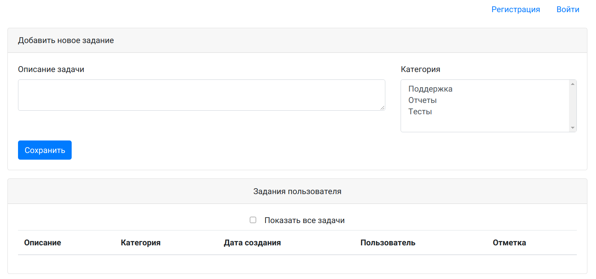
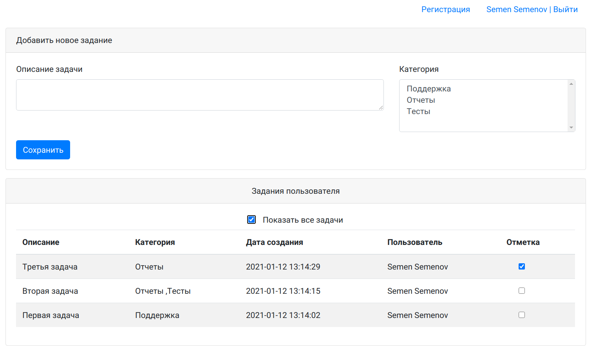
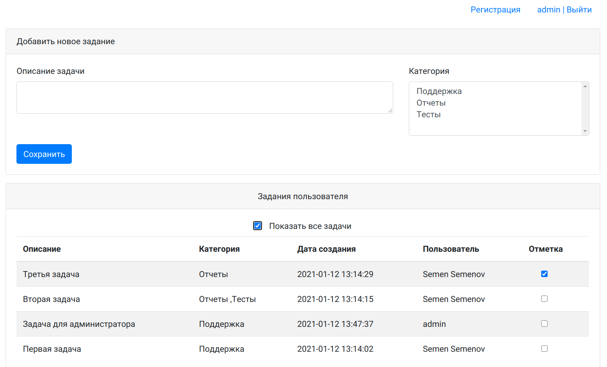
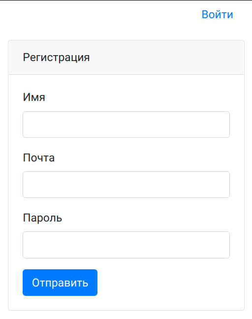
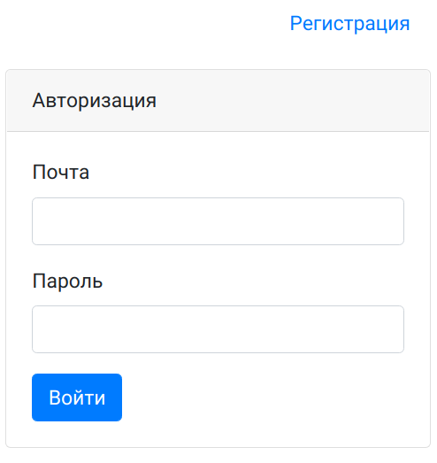
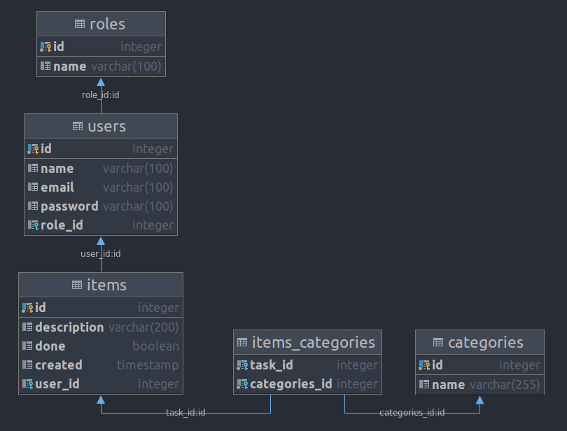

# Проект - TODO list

## Описание

Классический список дел. Задачи храняться в базе данных. Есть авторизация. Заданиям можно присваивать категории. 
Задание с отметкой скрывается из списка дел. Чтобы отобразить все задачи необходимо выбрать "Показать все задачи".

## Технологии

* Java 14
* Java Servlets
* Hibernate (HQL)
* Collections Framework
* PostgreSQL
* Библиотека GSON
* JSP/JSTL
* SLF4J/Log4j
* JavaScript, AJAX
* HTML, CSS, Bootstrap
* Maven
* Travis CI

## Функциональность

__Вход без регистрации__

__Вход под пользователем__

__Вход под администратором (видны задачи всех пользователей)__

__Страница регистрации__ 

__Страница авторизации__ 

__Схема базы данных__ 

#### Контакты

&nbsp;
&nbsp;